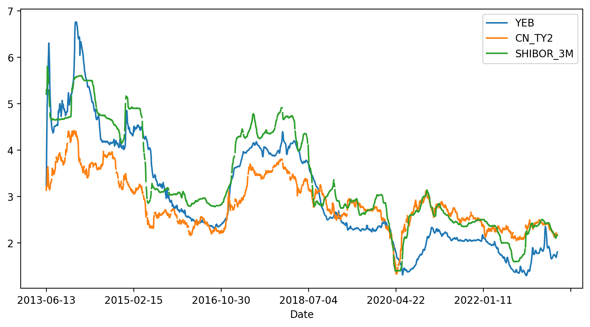

# 选择投资工具：银行理财、基金和股票，到底买哪个

如果不是对金融投资有特别研究的人，一般我们平时能接触到的投资品种基本就是余额宝、银行理财、基金和股票了。至于他们的具体区别，很多人其实是傻傻分不清楚的，对它们的认识基本上是停留在某种刻板印象里。比如：余额宝和银行理财稳定不会亏本，但是收益率低；专业的事情交给专业的人，所以普通人买基金；股票就是割韭菜。

在开始认真投资之前，必须要求自己养成一个认真审视概念的习惯。概念是一个名词，帮助人们交流观念，但是概念很多时候是隐含着巨大的陷阱的。原因就是一般人并不会认真搞清楚概念背后是什么，只是凭自己的感觉去理解它，两个使用相同概念沟通的人，它们大脑中对应的内涵却可能差异极大。

本篇就试着说清楚我们平时最常会用到的几种投资工具的本质，以后不会再人云亦云。

## 余额宝就是货币基金

余额宝是 2013 年 6 月份支付宝发布的一款互联网理财产品，因为依托支付宝便捷的银行支付通道和远高于当时银行活期存款的收益率，余额宝迅速成为体量最大的基金。

余额宝本质上是一种货币市场基金，早在1970年代的美国就已经很流行。货币市场基金和银行活期存款是有区别的，银行活期存款顾名思义是存在银行里的钱，这些钱记在你的账户里，银行可以把这些钱借出去，并以央行的法定利率给你利息。你的存款受银行业监管法和存款保险条例的保护。货币基金的底层资产相对就丰富了很多，会包括通知存款、短期大额存单、短期债券、债券回购等等。这些资产很多只在金融机构之间交易，所以一般小额储户是接触不到的。货币基金的创新性在于，收集了大量小资金来参与这些高流动性的短期货币市场，实现比活期利率更高的收益。余额宝更进一步降低了投资货币基金的门槛，一分钱也可以投。对于支付宝用户来说，反正放银行和放支付宝也没区别，但是对于支付宝就意义重大了，相当于完成了一次全民性的从银行到支付宝的储蓄大搬家。

余额宝是一次互联网思维冲击金融业的完美案例，余额宝的发布时机其实是精挑细选的。2013 年 6 月 20 日，中国发生了著名的”钱荒事件“，事件的起因和当时国内国内的经济环境和央行政策有关。支付宝显然是预判了短期资金紧张会推升货币市场利率，也就是说货币基金的收益率在那个时间点会快速升高。

下图是余额宝、2年期国债和3个月银行间拆借利率的走势，从趋势上看，它们是一致的。所以余额宝并不神秘，它的火爆只是信息差造成的一种现象。当宏观利率进入下行通道，它的收益率自然也就随之下降了。

从我们选择投资工具的角度，余额宝是比银行活期存款更好的工具，目前为止对于余额宝知道这一点就够了。随着你对金融市场的认识越来越多，会知道更多比余额宝更有效的高流动性管理工具。

## 不要买基金、不要买基金、不要买基金

重要的话说三遍，不要买基金。这里说的基金主要是指国内基金公司发行的偏股票型主动管理基金。

### 基金存在道德性风险

什么叫道德性风险，就是基金经理的利益和基民的根本利益不一致，也就是塔勒布所说的非对称性风险。基金经理和基金公司的收益来自基金的管理费用，在国内这个费用 1~3% 可能都很常见，也就是说，不管这只基金赚了还是赔了，基金公司都可以稳定获得固定比例的收益。所以对于基金公司来说，基金的规模是最重要的。前几年基金发行的火爆的时候，甚至出现了基金经理网红化的现象，包装出女神、男神人设，甚至开始打电梯广告。基金公司是要抢在基民入市的过程中快速做大基金规模。

他们不在乎基金收益吗？这是一个很好的问题，他们当然在乎，因为收益高，排名就高，曝光度就高，基金规模就可以进一步做大，管理费用也会水涨船高。但问题是，这是一个极其内卷的市场，基金公司的信息、策略严重同质化，他们是很难做出差异化的，也就是说，他们其实很难有超出市场的表现的。可是为什么总是有基金经理的收益远高于市场和其他基金呢？如果你多看几年排行榜，可以很容易得出一个结论，排行榜的变化极其巨大，也就是说他们上榜靠运气的可能性更大。当然，事后归因总是可以说得头头是道。

### 选基金的难度远大于选股票

上面的说法有一棒子打死一船人的嫌疑，一定有基金经理是有职业道德和职业追去的。问题是，我们如何找到他们呢？你要知道，我们可以选择的基金有8000多只，而股票只有5000多只。每只股票背后都是一家上市公司，他们要按照证监会的要求每个季度发布经营状况。虽然财报也有坑，但总比我们去揣测人性来的可靠吧。

如果你买过基金，你好好想想你买入的决策是如何做出的。你能相信他的人品吗，他会不会搞老鼠仓？你理解他的投资风格和策略吗？你跟踪过他的持仓吗？他过往的收益和当时的市场环境是什么关系，能稳定获得超越市场的收益吗？

还是因为他的曝光度更高，更容易看到，银行、互联网上都在说他好？其实最近两年是非常好的认清这个问题的时间，因为你可以很容易看到，市场整体下行的情况下，他们的表现。

## 股票投资是一个沙里淘金的过程

股票投资是一种既简单又复杂的游戏。简单是因为普通人开个户就可以买卖股票，难是因为不亏很难。这就导致股票投资产生的认知误区最多。

有的人听到股票投资就想到割韭菜，避之唯恐不及，这说明他对股票完全没有了解，社会主义国家怎么会搞一个纯割大众韭菜的场所呢。

有的人说起股票就是趋势、金叉，对着各种K线形态刻舟求剑。

也有的人追逐概念、热点、打板，在人性的缺陷中玩着互掏腰包的游戏。

这些不是完全不能赚到钱，但是如果放在足够长的时间看，墨菲定律肯定会应验。无非是些幸运儿和随机漫步的傻瓜。

允许系统随机表现的程序员肯定是不合格的，他们靠运气做系统。我们要追求的是可解释性和一定的数学严密。

如果用一句简单的话来总结，我希望你把股票投资理解成一个在沙子里淘金的事情。市场中的沙子远多过金子，我们就是要在空间和时间维度上，找到那些成为金子的机会，而避开那些沙子的陷阱。

进行中。。。