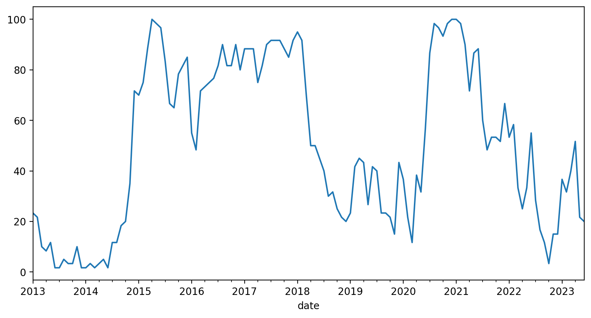
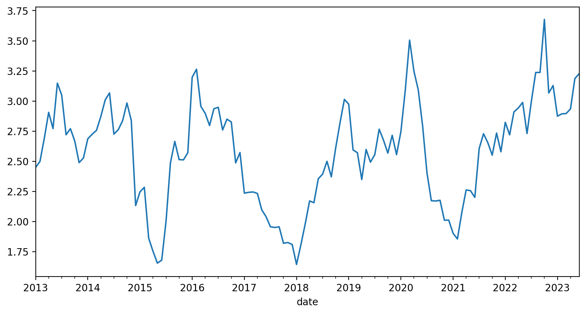

# 车票和上下车时机：宽基指数的投资方法

对股市投资有过认真研究的人，肯定接触过宽基策略。在我看来，是否能<strong>理解</strong>宽基投资的逻辑，甚至可以成为一个投资者是否入门的标准。不是因为宽基多么优秀，而是因为理解了宽基意味着理解了市场的周期性，知道敬畏市场，同时对自己有清醒的认识。

宽基有很多种分类，比如沪深 300 这种按照市值和流动性加权编制的指数，也有红利 ETF 这种策略类指数。作为我们股票入门投资的品种，沪深 300 ETF 是一个很好的选择。我们把它作为上车的车票。

## 投资沪深 300 的底层信仰

投资股市是为了在未来获取资本增值，那么就得搞清楚资本增值来自何处。沪深 300 代表了当下中国最重要的 300 家上市公司，它们市值最大，流动性最好。

投资沪深 300 就意味着投资了一篮子中国头部公司，这表示我们认为这些公司在未来会表现得很好。沪深 300 的表现事实上和中国经济高度相关，我们可以把投资沪深 300 当成投资中国。不过未来是很难预测的，所以，关于是否要投资沪深 300，需要一点信仰。回答自己一个问题，我到底是否看好中国经济的未来，如果答案是否定的，那么就应该远离中国股市，因为覆巢之下无完卵，在一个整体下行的市场中投资很难有好结果。

我的答案是坚定看好中国，这一方面是因为作为中国人的立场，另一方面是对中国充满信心。巴菲特说他的成功是开始于一颗幸运的精子，这种幸运换句话说就是因为他是美国人，在恰当的时间出生在一个上升趋势中的国家。他的幸运是以别人的不幸为代价的，这并不公平，我们这代人就是要为子孙后代赢得类似的幸运。

沪深 300 也是有缺点的，这和它的编制方式有关，沪深 300 以市值作为权重，每半年调整一次，这也就意味着进入沪深 300 有一个市值门槛，但是很多门槛之下的黑马反而是增长最好的股票，等它们能够进入沪深 300 的时候可能已经进入成熟期，增长放缓了。所以不能要求沪深 300 像市场炒作的热门股票那样高速增长，我们对沪深 300 的要求就是稳定跟上中国经济，并略有超出。

## 预期收益率和无风险收益率

我们要在这里引入一个预期收益率的概念。顾名思义，预期收益率就是对于一个投资标的，预期它带来的年华收益率。

这个收益率多少合适呢？需要一个比较基准。通常使用十年期国债收益率作为无风险收益率，因为国债是用政府信用做背书的，我们认为政府信用无风险。我们使用这个无风险收益率作为比较基准。

沪深 300 是股票，是有风险的，我们需要一定的风险溢价，根据经验，选择三倍无风险收益率作为沪深 300 的预期收益率。也就是说，如果十年期国债的收益率是 3%，我们要求沪深 300 的预期回报要达到 9% 才可以。当然，你也可以根据自己的情况调整这个风险溢价的倍数，后面我们也会解释这个溢价倍数的选择标准。

## 沪深300可以无脑买入吗？

我们已经选择了沪深 300 作为车票，可能也听过很多人推崇买沪深300 ETF，但是真的可以在任何时间无脑买入吗？

先来看一下沪深 300 的走势（凡涉及沪深 300 的价格数据都以 510300 ETF为准，它包含了打新和分红）：

假设我们听信了某个自媒体的鼓吹，无脑买入沪深 300 ETF，会发生什么呢？

| 年份 | 净值 | 持有年限 | 最高点 | 最低点 | 总回报 | 最大回撤 |年化收益率 |
| --- | ---- | ---- | ----- | ----- | ----- | ------- | ------- |
| 2012 | 2.71 | 11.16 |5.81 |2.08 | 43 | -64.15 |3.26 |
| 2013 | 2.53 | 10.49 |5.81 |2.08 | 53.44 | -64.15 |4.17 |
| 2014 | 2.37 | 9.5|5.81 |2.08 | 63.94 | -64.15 |5.34 |
| 2015 | 3.69 | 8.49 |5.81 |2.85 |5.26 | -50.94 |0.61 |
| 2016 | 3.54 | 7.49 |5.81 |2.85 |9.82 | -50.94 |1.26 |
| 2017 | 3.4| 6.49 |5.81 |3.02 | 14.31 | -48.05 |2.08 |
| 2018 | 4.14 | 5.49 |5.81 |3.02 | -6.14 | -48.05 |-1.15 |
| 2019 | 3.02 | 4.49 |5.81 |3.02 | 28.67 | -48.05 |5.77 |
| 2020 | 4.15 | 3.49 |5.81 |3.53 | -6.44 | -39.28 |-1.89 |
| 2021 | 5.33 | 2.48 |5.81 |3.57 |-27.22 | -38.61 | -12 |
| 2022 | 4.99 | 1.48 |4.99 |3.57 |-22.2| -28.56 | -15.56 |
| 2023 | 3.95 | 0.49 |4.2|3.8| -1.7|-9.73 |-3.45 |

假设在一年的第一个交易日买入，截止目前（2023年6月30日）最后一个交易日。

如果我们是2012年买入的，经过11年的时间，你会获得 43% 的回报，年化回报率只有 3.26% ，持有过程中，你还要经历最大 64.15% 的回撤。

如果运气好一点，我们在 2014 年买入，截至目前总回报 63.94%，年化回报 5.34%，最大回撤 64.15%。

从统计来看，无论哪个年份买入，到目前为止，都算不上成功的投资，甚至可以说惨淡。

所以，沪深 300 不能无脑买入。我们需要更有效的策略。

## 定投是个好策略吗？

指数基金定投是一个非常流行的话题，被很多人描绘成普通人的投资银弹。但是，很少有人认真去计算一下定投的实际效果，我们以沪深 300 最近 10 年的数据来做一个测试，看看定投到底是不是好的投资策略。

如果我们从2013年开始定投沪深 300 ETF，每个月第一个交易日买入 1000 元，到目前一共投入 126期，总收益率只有 9.4%。即使按照2021年初的最高点计算，也只有 58% 的收益。如果从2021年开始定投，就更惨了，两年半的时间，总收益率是 -15.74% 。

从结果来看，定投沪深 300 的表现其实和沪深 300 本身的走势是一致的，并不会比一次性买入持有带来太多的优化，甚至不如买在幸运位置的表现。定投的实际意义有两个，一个是强制储蓄，从定投的总资产增长曲线也可以看出，我们的资产基本是在稳定增长的。

第二个意义是避免了择时，我们不需要关心什么时候买，也能获得与沪深 300 表现一致的投资组合。但是如果你真的手里有一大笔钱要投资，是不能把时间拉长到10年这样的维度去定投的，因为闲置的资金也有机会成本。

所以定投并不是银弹，但是作为一种强制储蓄手段是可以的。定投不能优化持股体验，这和中国股市牛短熊长的特点有关，上涨的时间往往是短暂了，而大部分时间是在下跌。虽然看上去定投摊薄了成本，但持股过程的体验并不友好，我们能直观感受到的依然是跌跌不休。定投也没有平滑掉波动，长期来看，我们的投资组合依然是长窜下跳的。特别是随着定投时间越来越长，每一期投入的资金占总资金的比例会越来越低，我们实际上是在持有一个没有操作的长期仓位。

推荐普通人定投宽基的观点大多来自美国市场，美国的标普 500 指数确实有很好的定投体验，这是因为美国股市是一个牛长熊短的市场。而中国股市正好相反，所以不要期待通过定投获得超额收益和更好的持股体验。定投只是一种强制储蓄手段，而且由于股市的波动性，为了避免浮亏变实亏，不能随时取出，事实上导致流动性变差了。

## 两个指标选择上下车时机

股市投资其实就是在正确的价格买入正确的标的。投资沪深 300 这种宽基指数可以让我们不需要去研究公司，所以不存在选择标的的问题。唯一的问题就是什么是正确的价格，因为价格是一个时间序列，也可以换一个说法，什么时候买入什么时候卖出，也就是上下车时机问题。

### 市场温度计

有一些媒体设计了一种叫做市场温度的指标，让投资者根据市场温度来选择上下车时机，比如市场温度低于 25 度买进，高于 80 度卖出。这种指标既简单又有效。它背后的原始数据就是市盈率分位数。

不过，直接使用市场温度指标还是有很大风险的，因为我们很难从历史趋势中看到极端值的分布。如果我们可以自己计算这个指标，就可以更准确地理解背后的原理，也可以根据市场情况去调整对这个指标的使用。我们接下来就设计一个自己的市场温度指标。

首先，需要搞清楚市盈率这个概念。股票的市盈率（PE）是一个评估股票价格和公司盈利倍数的指标，计算方法是用当前股票价格除以每股盈利。一般来说，PE 越低意味着股票越便宜。指数也有 PE，指数的 PE 是通过指数成分股加权计算得到的，可以理解成这一篮子股票的价格和盈利倍数。所以，指数也是 PE 越低越便宜。

为什么 PE 是变化的？这是股票投资的一个核心问题。股票的价格不是由某个人决定的，而是由市场全体决定的，也就是由所有参与买卖的人决定。价格是交易的结果，因为不同的人对价值的理解不同，同一个人在不同的时间对价值的预期也不同，所以股票的价格是随着交易者预期的变化而变化。这种预期可能受新闻舆论、重大事件、个股盈利等各种因素影响。

股票市场的一个特点就是周期性地错误定价，这种错误一方面是表现在时间维度上的。比如当下宏观经济很差，市场就会比较悲观的预期未来一两年的企业盈利可能会很糟糕，所以就会给股票定价很低以反映当下的情况。但是从更长时间维度来看，宏观经济总是会走出低谷，所以定价是既正确又错误的。这种在时间维度上的定价错误，就是一种套利的机会，只是我们需要付出时间成本和未来不确定的风险。另一个方面，人们对未来的短期预期总是过激的，要么过度悲观要么过度乐观。这也给了我们一种估值在空间维度的一个套利机会，同样地，这种套利也需要承受估值回归的时间成本和不确定性风险。

那是不是找到两个 PE 数值就可以了，在低 PE 的位置买进，在高 PE 的位置卖出？理想模型是这样的，但实际情况会更复杂一些，首先，从时间维度上看，2023年和20年前的中国从经济在结构上差异非常大，所以20年前的 PE 数值和今天的 PE 数值是不能比较的。这是市面上那些股票温度计的最大问题，我们通过滚动计算的方法来优化一下，就是使用过去五年的 PE 数据滚动计算分位数。五年基本覆盖了一个小的经济周期，既能反映估值的变化，又不会因为经济差异太大导致不可比。下面是计算后得到的最近十年的沪深 300 PE 滚动分位数：

纵坐标的数值是从0~100的，数值越低意味着估值越低，越应该买入，数值越大估值越高，意味着越应该卖出，与目前流行的市场温度的理念一致。

与沪深 300 的价格走势做比较，可以非常直观地发现几个买卖点位，比如 2013年到2014年中，2020年上半年，2022年10月份的买入位置，2015年初、2018年初和2021年初的几个大顶部的卖出为位置。

### 格雷厄姆指数

估值分位数可以很好的捕获上下车时机。但是也有个问题，这些买卖点位出现的间隔都是以若干年计的。在这种时间尺度上操作，非常考验人的耐心。又因为，我们的经验都是靠与现实世界的反馈获得的，这种频率的操作，很难让我们在短期内产生可靠的经验，没有可靠的经验，就只能靠理性思考带来的信仰。这对于大部分人是很难做到的。

除非你的性格天生坚毅，对于新手，我们需要舍弃对于精准抄底和逃顶的执着。我们需要更频繁的操作，来积累对市场的感知和经验，虽然这会降低收益率提高成本。从积累经验的角度，这是值得的。

我们构建一个股票和债券的持仓来达到这个目标。我们可以根据自己的情况，以月或季度为频率来调整我们的仓位。调整的逻辑就是股票和债券的收益率平衡，我们引入一个叫股债收益比的指标，这个指标也叫格雷厄姆指数。

格雷厄姆指数是股票收益率和无风险收益率的比值，股票收益率采用沪深 300 PE（TTM）的倒数，无风险收益率采用中国十年期国债收益率。

具体操作层面，我们把仓位可以分为两个部分，一个部分是股票，另一个部分是国债，国债使用国债ETF作为底层资产。仓位随着格雷厄姆指数而调整，以适应市场估值的变化，来捕获市场由于错误定价产生的套利机会。

我们要求股票收益率要达到三倍以上的无风险收益率的情况下满仓股票，低于两倍无风险收益率的情况下空仓，其他时间按照比值动态调整。这样无论如何，我们都是保持留在市场中的。当然，相对于精准地抄底和逃顶，我们一定放大了部分风险，但是我们认为留在市场中更重要，而且有国债收益率打底，我们整体持仓的表现会更加稳定。

这个策略我们可以在未来讲到回测的时候实际验证一下。

